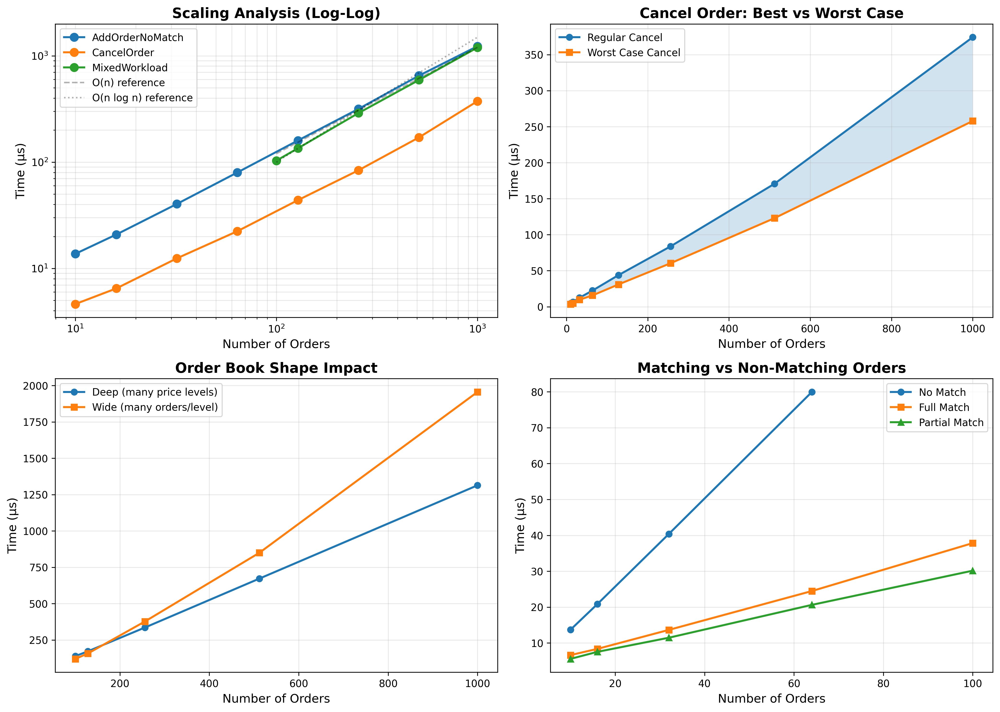

# Morningside Wagewise: Wage your Wagers Wisely

A high-performance C++ market data feed handler and local orderbook implementation for Kalshi prediction markets, designed to enable development  of algorithmic trading and market making strategies.



## Overview

We fetch real-time market data from Kalshi's REST API and maintain a local orderbook replica for ultra-low latency trading operations. The system abstracts Kalshi's binary "Yes/No" betting markets into traditional bid/ask order flow, enabling standard options/futures-like pricing models.

## Architecture

```
┌─────────────────┐    ┌──────────────────┐    ┌─────────────────┐
│   Kalshi API    │────│  MarketDataFeed  │────│ Local Orderbook │
│  (HTTP/WS)      │    │     Handler      │    │    Engine       │
└─────────────────┘    └──────────────────┘    └─────────────────┘
```

## Quick Start

```bash
mkdir build && cd build
cmake ..
cmake --build .

./morningside-wagewise
```

**Dependencies**: `libcurl`, `nlohmann/json`, C++20 compiler

## Features

### Market Data Integration
- Fetches orderbook data via REST endpoint by passing market ticker symbols
- Architected to support additional betting exchanges (Polymarket, etc.)

### Local Orderbook Engine
The core orderbook supports sophisticated order management:
- Supports multiple order types: `GoodTillCancel` and `FillAndKill`
- **Price-Time Priority Matching Algorithm**
- Automatically generates a trade when bids cross asks
- Level Info: aggregated bid/ask levels for market analysis

```cpp
// Example Usage: Add order and get resulting trades
auto order = std::make_shared<Order>(OrderType::GoodTillCancel, 123, Side::Buy, 55, 100);
Trades trades = orderbook.AddOrder(order);
```

## [NEW] Performance Benchmarks

 
We tested the core operations of our limit order book implementation across various scenarios, isolated from the Kalshi market data feed handler. We use [Google Benchmark](https://github.com/google/benchmark), a microbenchmarking library that provides high-precision performance measurements for C++ code. Google Benchmark runs each test multiple times, automatically determines the number of iterations needed for stable results, and provides statistical analysis of the measurements. We test:

- Adding orders (with/without matching), canceling orders, and querying order information
- Mixed operations simulating real trading patterns, high-frequency trading scenarios
- Stress Tests on deep order books (many price levels) vs wide order books (many orders per price level)
- Fill-and-kill orders, worst-case cancel operations, and partial matching

The benchmarks measure time complexity and throughput under different load conditions (10 to 1,000 orders) to validate our data structure choices: `std::map` for price levels, `std::list` for FIFO ordering, and `std::unordered_map` for O(1) order lookups.


```bash
# Run all benchmarks
./orderbook_benchmarks

# Run specific benchmark with filter
./orderbook_benchmarks --benchmark_filter=BM_AddOrder
```

### Performance Summary

| Operation | Time (1000 orders) | Per-Order Cost | Complexity |
|-----------|-------------------|----------------|------------|
| Add Order (no match) | 1,229 μs | 1.23 μs | O(log n) |
| Cancel Order | 374 μs | 0.37 μs | O(1) |
| Get Order Infos | 62 ns | — | O(1) |
| Size | 2 ns | — | O(1) |
| Mixed Workload | 1,196 μs | 1.20 μs | — |

### Throughput
- **Simple Operations**: ~823,000 adds/sec, ~2.7M cancels/sec
- **Mixed Workload**: ~813,000 ops/sec (60% add, 30% cancel, 10% query)
- **Matching Engine**: ~26,000 full matches/sec (100 orders)


## Next Steps

We currently use Kalshi's HTTP REST endpoint for initial orderbook snapshots. While Kalshi offers WebSocket feeds for real-time updates, this serves as a working proof of concept for the data pipeline and orderbook integration. We show in the `main.cpp` example that we are able to fetch market data from Kalshi API, populate the Orderbook and manage its state and match orders. We can expand this in multiple ways:

- WebSocket integration for real-time updates
- Order lifecycle management (fills, cancellations from exchange)
- State synchronization with live Kalshi orderbook
- Multi-exchange adapter pattern


